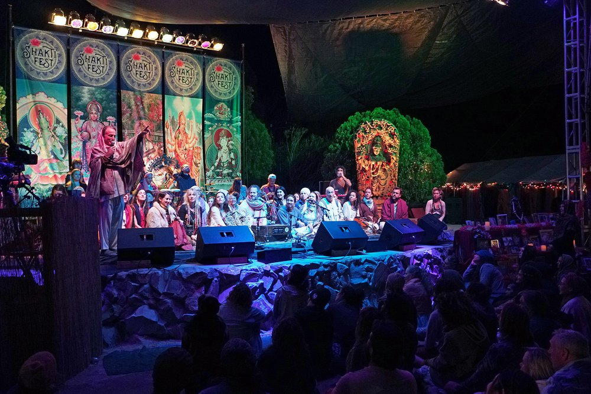

---

# 🎉 **PLANORA – Event Management & Booking Web Application**

### *A Full-Stack JSP + Servlet + JDBC Platform for Seamless Event Management*

<p align="center">
  
  
  
  
  
  
</p>

---

# 🌿 **Overview**

**PLANORA** is a **web-based event management platform** that enables users to explore, register, and book upcoming events while providing event organizers a **dynamic backend for efficient management**.

It delivers:

* 📅 Browse & register for upcoming events
* 📝 Manage personal bookings
* 👥 Admin panel for event & user management
* ⚙ Seamless integration of JSP, Servlets, and MySQL for a **dynamic full-stack experience**

---

# ⭐ **Why This Project Matters**

* Simplifies **event discovery and booking**
* Enables **efficient backend management** for organizers
* Provides a **modern, responsive, and user-friendly UI**
* Bridges **frontend and backend workflows** seamlessly
* Scalable foundation for **future enhancements** like analytics and online payments

---

# 🚀 **Key Features**

## 👤 **User Module**

* 🔐 User registration & login
* 📅 Browse & view upcoming events
* 📝 Book events with one click
* 📄 View & manage *My Bookings*
* 🚪 Secure logout functionality

---

## 🛠 **Admin Module**

* 🗂 Create, update, and manage events
* 👥 Manage user accounts
* 📊 View and track all bookings
* ✏ CRUD operations for events
* 🧾 Backend management via JSP/Servlets

---

## 🎨 **Frontend Experience**

* 🌐 Dynamic JSP pages
* 🎴 Event cards, banners & visual listings
* 📱 Responsive UI design
* 🎨 Styled with HTML5, CSS3, JavaScript
* 🔔 Smooth, intuitive booking workflow

---

## 💾 **Backend & Logic**

* ⚙ Java Servlets
* 🔌 JDBC connectivity
* 🗄 MySQL database integration
* 📚 DAO-style architecture
* 🧱 Deployed on Apache Tomcat

---

# 🧭 **Project Structure**

```
PLANORA/
│
├── src/main/java/com/portal
│   ├── dao/
│   ├── beans/
│   ├── servlet/
│   └── conf/
│
├── src/main/webapp
│   ├── index.jsp
│   ├── login.jsp
│   ├── register.jsp
│   ├── upcoming_event.jsp
│   ├── admin.jsp
│   ├── my_bookings.jsp
│   ├── event_booking.jsp
│   ├── logout.jsp
│   ├── images/
│   ├── css/
│   ├── js/
│   ├── META-INF/
│   └── WEB-INF/
│       ├── web.xml
│       └── lib/
│           └── mysql-connector-j-9.2.0.jar
│
├── build/
└── .project / .classpath / .settings
```

---

# 🔧 **Technologies & Tools**

## 🎨 Frontend

* JSP, HTML5, CSS3, JavaScript

## ⚙ Backend

* Java, JSP, Servlets, JDBC, MySQL

## 🌍 Server

* Apache Tomcat (8 / 9 / 10)

## 🗄 Database

* MySQL

---

# ▶️ **How to Run**

### 1️⃣ Import Project

* Open **Eclipse** or **IntelliJ**
* Import as *Existing Dynamic Web Project*

### 2️⃣ Configure Server

* Add **Apache Tomcat** (version 8–10 recommended)

### 3️⃣ Configure Database

Run the following in MySQL:

```sql
CREATE DATABASE event_portal;
USE event_portal;
```

*(Tables can be created as per DAO/SQL scripts)*

### 4️⃣ Update DB Credentials

In your DAO/Servlet files:

```java
url = "jdbc:mysql://localhost:3306/event_portal";
username = "root";
password = "your_password";
```

### 5️⃣ Run the Application

* Start Tomcat
* Open browser:

```
http://localhost:8080/PLANORA/
```

---

# 📸 **Screenshot Gallery**

Click images for full view:

<p align="center">
  <a href="src/main/webapp/mainindex.jpg"></a>
  <a href="src/main/webapp/shaktifest.jpg"></a>
  <a href="src/main/webapp/team.jpg"></a>
</p>

---

# 🌟 **Future Enhancements**

* 🔁 Migration to Spring Boot MVC
* 📊 Admin dashboard with analytics
* 💳 Online payment integration
* ✉ Email notifications
* 🔐 Token-based authentication
* 📱 Mobile app version

---

# 👩‍💻 **Developed By**

**Akanksha Sawant**

---

# 🔗 **License**

This project is **for learning and personal use only**.

All design, content, and code are © **Akanksha Sawant – All Rights Reserved**.

❗ Copying, redistributing, or reusing without explicit permission is prohibited.

---
---

